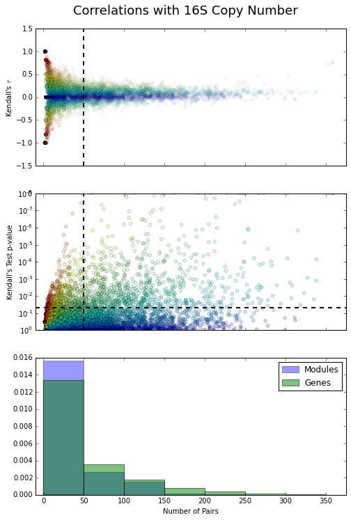
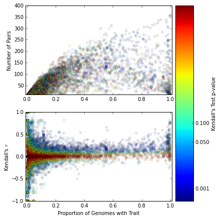
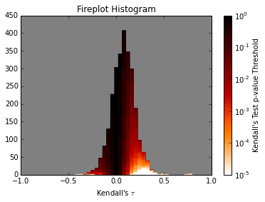
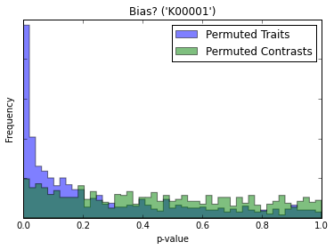
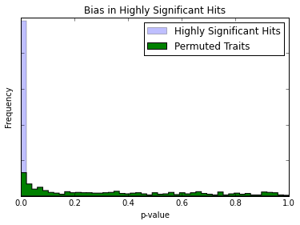
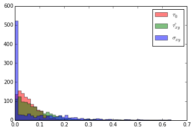
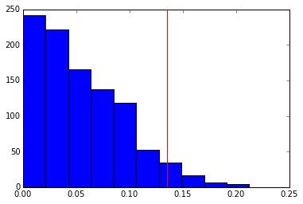
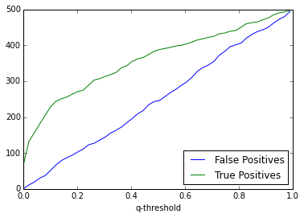

---
title: Comparative Genomics in Bacteria
author: Byron Smith & Ben Roller
...

# Introduction #
Here we will analyze the genomic signature of a growth-rate/yield trade-off.

16S rRNA copy number is an indicator of position along a life history axis.
Here we will explore the genomic content which goes along with that indicator.

# Requirements and Environment #
## Required Applications ##
-  [`python`](http://www.python.org/) (3.4+)
-  GNU Make
-  BASH

# Notebook #

## Glossary ##
[Kendall's $\tau$](https://en.wikipedia.org/wiki/Kendall_tau_rank_correlation_coefficient)
:   A non-parametric measure of the correlation between two vectors.
    It is very similar to Spearman's $\rho$, but has some slightly superior
    statistical properties.

Focal trait
:   A genomic trait which is compared to 16S copy number in the search
    for a statistical correlation.
    In this project, these traits are either K0 orthologous groups,
    or M0 modules.
    The trait value can either be binary (presence/absence) or positive
    integers (number of copies).
    For example, the 16S ribosomal RNA gene (K01977) itself can have any value
    between 0 and 15.

Contrast table
:   A table of two vectors encoding the arithmetic differences between
    paired species in two traits.
    For example:

    Pair    Trait 1 (A)    Trait 1 (B)    Trait 2 (A)    Trait 2 (B)
    ----    -----------    -----------    -----------    -----------
    A/B     1              2              5              3
    C/D     2              1              4              5

     Table: The trait values of four taxa for two traits

    Pair    Trait 1    Trait 2
    ----    -------    -------
    A/B     -1         2
    C/D     1          -1

     Table: Resulting contrast table

## Sister-Pairs Analysis ##
(date:2015-02-06)
I'm going to try and test each gene for a relationship with copy number.
Usually this would require accounting for phylogenetic relationship,
so instead I'm going to use sister-paired taxa, to control for this.

(date:2015-02-09)
I removed lines 15 and 16 and renamed the RAxML tree to `tre/bacteria.nex`.
This allows the file to be opened with figtree.

## Independent Pairs ##
(date:2015-02-10)
Unlikely the all-by-all potential pairings that I have worked with up to this
point, paired analyses actually require that there not be overlap between
the evolutionary histories of the pairs being compared (because this
represents non-independence/pseudoreplication).
Looking at Maddison 2000, I believe that I can implement their algorithm for
selecting a maximal number of taxon pairs which differ in both characters.
I intend to use this to devise paired sets for each character contrast.
I will also have to calculate a null distribution with a permutation test
BEFORE matching pairs.

(date:2015-02-11)
I managed to get the algorithm working.
Now I just need to package it into a python script which will do the full
analysis.

(date:2015-02-12)
I'd like to use evolutionarily independent pairing to test the correlations
between various genes and 16S copy number (actually _log_ copy number.
Ultimately I might want to compare it pairwise by genes).

(date:2015-02-15)
I can run all of the basic correlations for each K0 in about 10 minutes.
M0 take far less time.
All results have been saved to `res/*0.paired_corr.tsv`.
I get a few hundred results for K0s with more than 50 pairs considered and
p-values less than 0.005.
The top two hits are 16S and 23S rRNA genes, as you might expect.
Hits further down the list are more interesting.  What I should now do is
compare these correlations with a null distribution based on a permutation
test.

### Non-deterministic pair picking ###
(date:2015-02-19)
I found that each run of the pairwise correlation script gave a different output.
This didn't make sense, and scared me.

Turns out that I was assuming my dictionary keys would be iterated back in the
same order each time.
This was incorrect.

I re-did some of the analysis that had been done over the last few days.
This has allowed me to clean up a few figures, and think critically about
these results.

### Analysis of Results ###
#### Pairs, $\tau$ and p-values ####
(date:2015-02-19)
What are the relationships between number of pairs, $\tau$, and p-value?

A few things stick out.

1. The number of pairs (I'll also refer to it as $n$) ranges from 0 to
    about 350.
2. Clearly $\tau$ is closely related to the number of pairs found.
    -  At low numbers of pairs, a great range of $\tau$'s are possible,
        including many with high values.
        These are probably worthless.
    -  The distribution of $\tau$ doesn't change much at higher values of
        $n$ (pairs).
    -  There is a subtle but consistent skew towards values of $\tau$ above 0.
        This especially stands out at intermediate number of pairs, although
        this could be the result of thinning numbers of points making
        it more visible.
3. A relatively small minority of traits pass both a $n$ and p-value cutoff.
4. Modules generally have a lower $n$ than genes.

#### Trait frequency against pair count ####
(date:2015-02-19)
What's the relationship between the absolute number of species with a gene,
and the number of pairs that were found?

1. There is no obvious relationship between the number of genomes with a trait
    and p-value.
2. The number of pairs increases as the frequency of the trait increases,
    although this trend is not perfect.
3. $\tau$ _may_ increase with frequency, but it's not clear.
4. Many high $\tau$ traits are at high frequency
    -  These may represent traits which mostly vary in number,
        not presence/absence. (e.g. tRNAs)

#### Effect of p-value on the distribution of $\tau$ ####
(date:2015-02-19)
How does the distribution of $\tau$ values change as you adjust the p-value
cutoff?

I'm really proud of this figure:

I call it a fire plot.
The point is that you can trace a histogram at an arbitrary cutoff value,
in this case p-value, by tracing the 'iso-hue' line.

This figure shows that the shape of the distribution changes a _lot_
with p-value.
As you might expect, it become multimodal, since small absolute values of
$\tau$ don't lend themselves to statistical significance.

### Evidence of bias in $\tau$ ###
(date:2015-02-20)
Is there bias in the estimated correlations introduced by the picking of
pairs which vary in both traits?

Here I've used various permutation methods to get at the null distribution of
p-values.
When I permute the vector of values for K00001 (which does not show any
statistical significance), and then re-pick mixed pairs, contrast the pairs,
and calculate a p-value for Kendall's test, I still get a higher than
expected frequency of _low_ p-values.
(The expectation for p-values is uniform.)
This means that my picking method is introducing bias, since I _know_ that
there is no evolutionary correlation between copy number and the permuted
trait values.
I also know that this bias is not the result of the Kendall test on
vectors of contrasts (which, by definition have no 0's), since
I compare the p-value distribution to that obtained by permuting the
contrast table;
the result of that is a fairly uniform distribution.

It therefore seems possible that I am getting some correlations with
p-values under 0.05 purely due to this bias.  In fact, in this permutation run,
8.7% of my p-values came back under 0.05 and 1 in 200 came back $< 0.001$.

This seems problematic, since I want to be able to identify genes
with a p-value threshold.
I'd also like to be able to account for multiple testing
by doing a Bonferonni correction, but bias will invalidate this approach.

...

What fraction of the time might my hits under some p-value threshold
be accounted for by this bias?
I can be a liiiitle comforted by the next result:

(Figure 4?)

This figure shows that for traits which passed a 0.001 ("highly significant")
p-value threshold, the majority of them are no longer under that
threshold when we permute. (2.7% have p-values under this cutoff.
We would have expected 0.1%).

I really don't know if this is a good thing or not.  At what point can I say,
"yes, I know that there's bias, but I am just going to increase my p-value
threshold and ignore it"?

### Correcting for bias ###
(date:2015-02-23)
In order to avoid the bias which appears to arise with this approach,
I am going to try a few things.

#### Alternative sampling schemes ####
Can we still achieve the required power if we only pick pairs based on
contrasts in 16S copy number, not the other trait as well?
Will this remove the bias that we're seeing?
Even if it doesn't, having just one set of pre-picked pairs will make
a permutation test much more computationally feasible, since we won't have
to re-pick them each time, just randomize the second trait.

While this approach may mitigate the effects of bias, it may also
decrease our power to detect correlations, which would be unfortunate.
You can see this in action when I re-check all 240 K0 highly "hits"
(p-value < 0.001) in the 358 pairs with mixed 16S copy number;
only 158 (66%) are still highly significant.
Nonetheless, $\tau$ and p-values are correlated across pair selection
strategies

#### Permutation test to calculate p-values ####

#### False discovery rate with a permutation test ####
Is it valid to:
-  Assume that the null distribution of p-values for my (very mixed)
   population of traits is given by a permutation for every gene.
-  Asses the fraction of these permutation statistics which are
   counterfactually marked as significant as a function of the p-value
   threshold (or a $\tau$ threshold should work too, right?)
-  Conclude that at a given threshold I _know_ the fraction of true negatives
   which have incorrectly been marked as positives.
-  Choose a p-value threshold which keeps this number as low as I'd like.

Basically what I'm proposing is to use the permutation test distribution from
this figure (4?) to make a statement about my
[false discover rate](https://en.wikipedia.org/wiki/False_discovery_rate).

In simulation this seems to work as I expect.
I simulated a set of either correlated (or not) vectors of values
(multivariate normal distribution).
The distribution of correlations included 500 which were uncorrelated and
500 which had correlations normally distributed around $0$, with a variance
of $0.2$.
From these 1000 vector-pairs (each length 100) I estimated Kendall's
$\tau$, as well as $\tau$ under the null hypothesis which I got from permuting
one of the vectors.
I plotted the absolute values of those two sets of estimates along with the
"true" correlation values.

On a histogram of just the absolute values of $\tau$ from the null distribution,
I chose a threshold which left me with only 5% of the null $\tau$ estimates.

This represents a false positive rate of $0.05$.
I then applied this threshold to categorize the estimates of true
$\tau$ into correlated/not correlated categories.
From this process I got around 25 false positives (correlations which
came from a parameter of 0 but which had a $\hat{\tau_{xy}}$<!--_-->
above the threshold) and about 190 true positives (remember the average effect
size was pretty small and the vectors were only of length 100).

As I vary my rate of false positives given a null distribution,
I get a linearly increasing number of false positives (a tautology) and
a quickly rising early, but saturating late, number of true positives.

This approach should allow me to set my maximum number of false positives
arbitrarily.
However, I will not be able to know what fraction of my "hits" are actually
false positive, because the number of _true_ correlations which conform to
the null hypothesis is unknown.
Both the distribution of effect sizes has a large impact on my false discovery
rate.

[Further](https://en.wikipedia.org/wiki/Multiple_comparisons_problem),
[reading](http://stats.stackexchange.com/questions/60460/permutation-test-for-multiple-correlation-test-statistics).

I think I may be able to say something about the maximum number of false
positives, since it must be around $\hat{q_\alpha} \times m$<!--_--> if
$m = m_0$.
Maybe we can put upper bounds on it given just knowledge of the number of tests
which did _not_ come back as discoveries.
